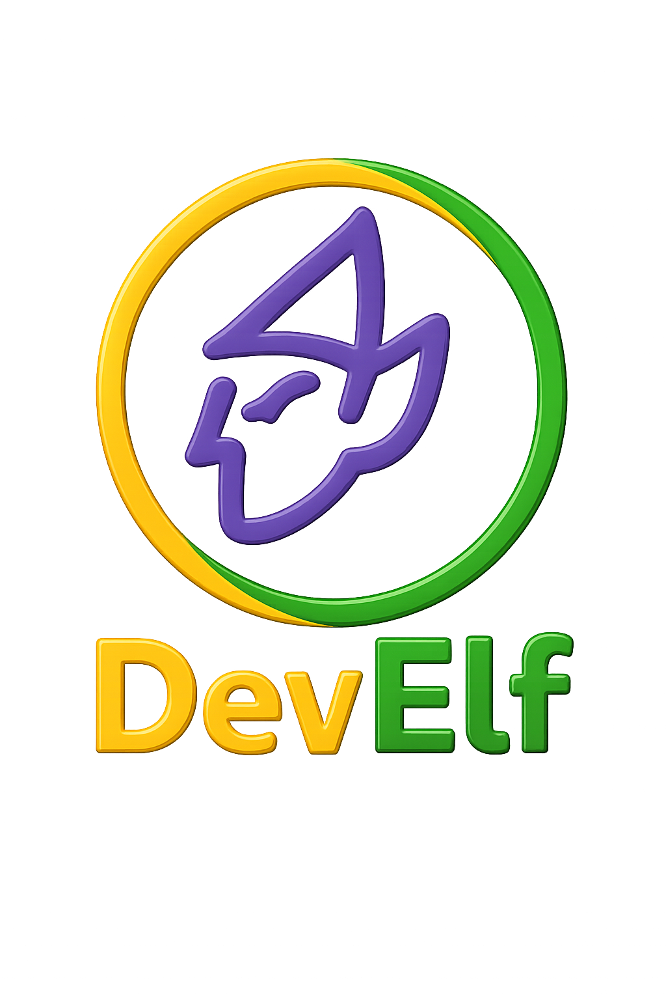

<p align="center">
  <picture>
    
  </picture>
</p>

# DevElf

Essential .NET libraries that make day-to-day development simpler and safer.

- Core utilities for argument validation and fluent string checks
- Logging helpers with disposable message scopes, property accumulation, and strict LIFO enforcement

> [!WARNING]
> **This library is currently in development and is not ready for production use.**
> 
> The API is subject to breaking changes without notice. Features may be incomplete or unstable.
> Use at your own risk in non-production environments only.

> [!NOTE]
> This repository targets .NET 10.0.

[](https://www.nuget.org/packages/DevElf/)

[](https://www.nuget.org/packages/DevElf.Logging/)

[](https://github.com/jlbarreda/dev-elf/actions/workflows/ci-cd.yml)

[](https://github.com/jlbarreda/dev-elf/blob/main/LICENSE)

## Features

- Argument validation:
  - `ThrowIfNull`, `ThrowIfNullOrEmpty`, `ThrowIfNullOrWhiteSpace`
  - `ThrowIfNotDefined` for enums
- Nullable string helpers:
  - `IsNull`, `IsNullOrEmpty`, `IsNullOrWhiteSpace`
- Logging scopes:
  - `ILogger.BeginMessageScope(...)` returning an `ILogMessageScope`
  - Accumulate properties across nested scopes (child overrides parent)
  - Attach exceptions and change level/message/event id before dispose
  - Strict LIFO dispose with safety warning if out-of-order

> [!WARNING]
> Log message scopes must be disposed in LIFO order. Disposing out of order logs a warning and is ignored
> so a later correct dispose can succeed.

## Requirements

- .NET SDK 10.0+

## Quick start

### Development Setup

1. Clone the repository:
```bash
git clone https://github.com/jlbarreda/dev-elf.git
cd dev-elf
```

2. Install .NET tools and git hooks:
```bash
dotnet tool restore
dotnet husky install
```

3. Build and test:
```bash
dotnet build
dotnet test
```

### Build all projects:

```bash
dotnet build
```

Run tests:

```bash
dotnet test
```

## Versioning

This project uses automatic versioning based on conventional commits:

- `feat:` - New features (minor version bump)
- `fix:` - Bug fixes (patch version bump)  
- `BREAKING CHANGE:` - Breaking changes (major version bump)

### Pre-release Versions
During development, we use alpha pre-releases (e.g., `0.4.0-alpha.7`).

### Stable Releases
Stable releases follow semantic versioning (e.g., `1.0.0`).

For detailed information, see our [versioning guide](docs/versioning-guide.md) and [development setup](docs/development-setup.md).

## Usage

### Argument validation

```csharp
using DevElf.ArgumentValidation;

void Process(string name, DayOfWeek day)
{
    name.ThrowIfNullOrWhiteSpace();  // throws if null/empty/whitespace
    day.ThrowIfNotDefined();         // throws if undefined enum value

    // ... your logic
}
```

### Nullable string helpers

```csharp
using DevElf.Extensions;

string? input = GetInput();
if (input.IsNullOrWhiteSpace())
{
    // handle missing value
}
```

### Logging message scopes

```csharp
using DevElf.Logging;
using Microsoft.Extensions.DependencyInjection;
using Microsoft.Extensions.Logging;

// Register once at startup
var services = new ServiceCollection()
    .AddLogging(b => b.AddConsole())
    .AddLogMessageScopes();

var provider = services.BuildServiceProvider();
var logger = provider.GetRequiredService<ILogger<Program>>();

// Use a disposable message scope that logs on dispose
using (var scope = logger.BeginMessageScope(LogLevel.Information, new EventId(1001, "Import"), "Import completed"))
{
    scope.SetProperty("CorrelationId", Guid.NewGuid());

    try
    {
        // ... do work
    }
    catch (Exception ex)
    {
        scope.SetException(ex, setProperty: true);
        scope.ChangeLogLevel(LogLevel.Error);
        scope.ChangeMessage("Import failed");

        throw;
    }
} // message written here with accumulated properties
```

> [!IMPORTANT]
> Properties set on nested scopes are merged. When keys conflict, the innermost scope value wins.
